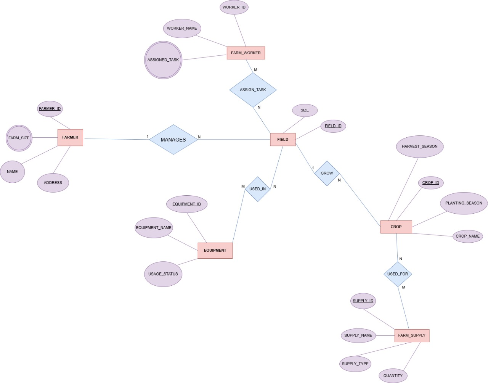
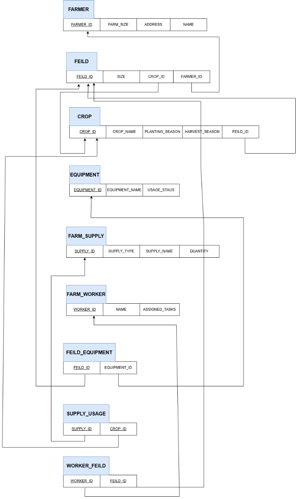

# 🌾 Farm Management System Database

A complete SQL-based relational database designed to model and manage the operations of a farming system.
This project demonstrates database modeling, relational integrity, and SQL data operations for real-world agricultural management.

---

## 📋 Overview

This system simulates the core components of farm management through structured tables and realistic relationships:

✅ Manages **farmers**, **fields**, **workers**, **equipment**, **crops**, and **supplies**
✅ Implements **cascading foreign keys** for referential integrity  
✅ Tracks **task assignments**, **equipment usage**, and **supply-to-crop** relationships  
✅ Supports queries for analysis, planning, and operational efficiency

---

## 📝 Features

- 🧑‍🌾 **Farmer & Farm Size Tracking**: Connects each farmer to their managed land
- 🗺️ **Field Management**: Assigns fields to specific farmers
- 👷 **Worker Assignment**: Maps workers to tasks and field responsibilities
- ⚙️ **Equipment Tracking**: Links equipment to fields based on availability
- 🌱 **Crop Seasons**: Models planting and harvesting seasons per crop
- 🧪 **Supply Usage**: Tracks which supplies are used for which crops
- 🔄 **Referential Integrity**: Enforced with cascading deletes for data consistency

---

## 🧩 ERD & Schema

📸 Below is the Entity-Relationship Diagram (ERD) and database schema structure:  
*(Make sure to replace the placeholder paths with the actual paths to your images)*

  


---

## 🛠️ Tech Stack

- **Language**: SQL
- **Compatible With**: PostgreSQL, MySQL

---

## 📁 Tables Included

| Table Name       | Description                                   |
|------------------|-----------------------------------------------|
| `Farmer`         | Stores farmer details                         |
| `Farm_Size`      | Tracks farm size per farmer                   |
| `Field`          | Individual field records                      |
| `Farm_Worker`    | Details about workers                         |
| `Assigned_Task`  | Tasks assigned to workers                     |
| `Assign_Task`    | Field assignments per worker                  |
| `Equipment`      | Equipment inventory and status                |
| `Used_In`        | Tracks which field uses which equipment       |
| `Crop`           | Crop type and seasonal information            |
| `Farm_Supply`    | Supplies and their categories                 |
| `Used_For`       | Supply usage per crop                         |

---

## 🚀 How to Use

1.  Clone the repository:
    ```bash
    git clone [https://github.com/ZiyadAzzaz/Farm-Management-DB.git](https://github.com/ZiyadAzzaz/Farm-Management-DB.git)
    cd Farm-Management-DB
    ```

2.  Run the SQL script in your database client.

    **For MySQL:**
    ```sql
    SOURCE farm_management.sql;
    ```

    **For PostgreSQL:**
    ```sql
    \i farm_management.sql
    ```
    Or, you can manually execute the entire SQL script in your preferred SQL client (like DBeaver, pgAdmin, or MySQL Workbench).

---

## 📊 Sample Data

✅ The script includes realistic sample data for all entities.  
🧪 Enables immediate testing of queries, joins, and reports.

---

## 💡 Project Purpose

This project was developed to help students and junior developers understand:

- SQL schema design and normalization
- Many-to-many relationships and join tables
- Use of `FOREIGN KEY` with `ON DELETE CASCADE`
- Real-world modeling of farm operations
- 
👉 **[View the Full Report Here](https://github.com/ZiyadAzzaz/Farm-Managment-DB/blob/main/Final-Report.pdf)**
---

## 🪪 License

This project is licensed under the MIT License.

You're free to:
- ✅ Use and modify the code
- ✅ Reuse for academic or personal projects
- ✅ Share or extend it

---

## 👨‍💻 Author

**Ziyad Azzaz**
- 🔗 **GitHub**: [ZiyadAzzaz](https://github.com/ZiyadAzzaz)
